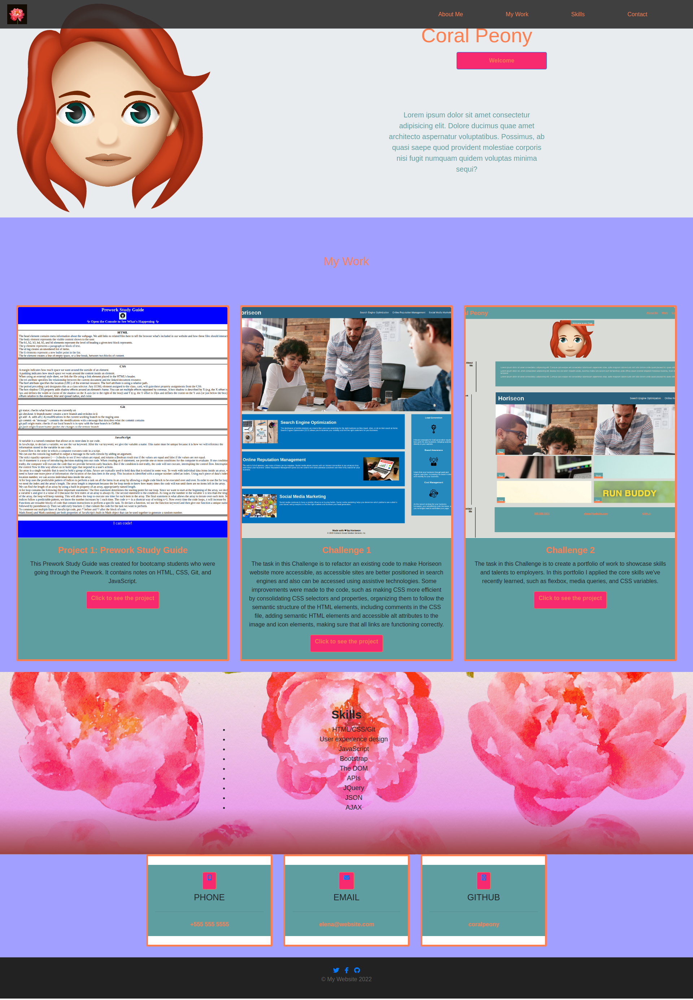

# Bootcamp: UK-VIRT-FE-PT-11-2022-U-LOLC-TWTH-1 Bootstrap-Portfolio-EDementieva Challenge Three

## Description

The task in this Challenge is to build a portfolio layout using the Bootstrap CSS Framework from scratch. 

In this challenge I applied the core skills we've recently learned, such as HTML, CSS, GitHub, GitHub Pages, and Bootstrap.

This portfolio highlights three projects I've done so far. 

## Installation

N/A

## Usage

The website is built using HTML and CSS. To review the code, open the Chrome DevTools by pressing Command+Option+I (macOS) or Control+Shift+I (Windows). A console panel should open either below or to the side of the webpage in the browser. 

https://coralpeony.github.io/Bootstrap-Portfolio-EDementieva/

## Credits

N/A

## License

Please refer to the LICENSE in the repo.